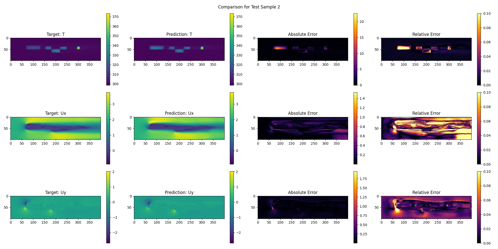

# Thermal UNet: Attention-Augmented Architecture for Coupled $T$ and $\mathbf{u}$ Prediction

The **Thermal UNet** is a specialized UNet designed for predicting 2D **temperature** ($T$) and **velocity fields** ($\mathbf{u} = \\{U_x,U_y\\}$) from inputs like thermal conductivity, power and boundary conditions.

---

## Key Architectural Features

### 1. Unified Encoder and Bottleneck
The network features a **shared encoder** for feature extraction, using four blocks with **$4 \times 4$ strided convolutions** (stride=2) for learnable downsampling instead of max-pooling. This path uses **Leaky ReLU** to ensure stable gradient flow. The encoder feeds into a **shared bottleneck** that captures high-level physical abstraction common to both fields.

### 2. Bifurcated Decoder
Post-bottleneck, the network splits into two independent decoder paths:
* **Velocity Decoder:** Reconstructs the two-channel vector field $(U_x, U_y)$.
* **Temperature Decoder:** Reconstructs the single-channel scalar field $(T)$.

This **separation** allows the model to specialize parameters for the distinct characteristics of smooth, diffusion-dominated scalar fields ($T$) and sharp, directional vector fields ($\mathbf{u}$).

### 3. Attention-Gated Skip Connections
The skip connections between the encoder and both decoder branches are enhanced with **Attention Gates (AGs)**. The AGs use the decoder signal to create a mask that **weights the encoder features**, prioritizing relevant spatial information (like boundaries or heat sources) while suppressing noise, thereby improving reconstruction accuracy.

### Technical Details

| Feature | Design Choice | Optimization / Rationale |
| :--- | :--- | :--- |
| **Input** | 3-channel (Conductivity, Power, BCs) | Provides necessary physics context. |
| **Downsampling** | $4 \times 4$ Strided Convs | Learnable and spatial information-preserving. |
| **Activation** | LeakyReLU (Encoder), ReLU (Decoder) | Mitigates dying ReLU; standard in reconstruction. |
| **Stabilization** | BatchNorm | Accelerates training and stabilizes features. |
| **Capacity** | Base channels scaled as $2^{expo}$ | Tuned via Optuna for optimal capacity-to-memory balance. |

### Loss and Data Augmentation
We use a custom **CombinedLoss** based on **Mean Squared Error (MSE)** with sum reduction. This choice is highly effective for continuous field prediction and robust across various batch sizes. To enhance the model's generalization, **Gaussian noise** is actively added to the input data during training as an augmentation strategy.

### Optimization and Hyperparameter Tuning
Training utilizes the **Adam optimizer** with custom betas $(\beta_1=0.5, \beta_2=0.999)$ and no weight decay. A **OneCycleLR learning rate scheduler** dynamically adjusts the learning rate up to a tuned maximum (ranging from $5 \times 10^{-4}$ to $1 \times 10^{-2}$), promoting faster convergence.
To boost GPU throughput, **Automatic Mixed Precision (AMP)** is employed. **Early stopping** (with patience up to 100 epochs) prevents overfitting by halting training when the validation loss plateaus.
Key hyperparameters (learning rate, dropout rate, base channel exponent, and batch size [16-32]) are systematically optimized using **Optuna** over 15 trials, with the goal of minimizing the validation loss.

### Data Handling and Splitting

The dataset undergoes **min-max normalization** on all outputs; specifically, the minimum temperature is fixed at $300\text{K}$ (ambient) for consistent scaling. The dataset is split into **$80\%$ training, $5\%$ validation, and $15\%$ test** sets.

### Example of Performance Visualization


---

## Data generation

The dataset for training the neural network is generated through physics-based simulations of heat transfer and fluid flow on a parameterized circuit board model. This involves creating varied geometries, setting up computational fluid dynamics (CFD) cases using OpenFOAM, running simulations, and post-processing the results into a standardized format. The process ensures a diverse set of scenarios to capture different thermal behaviors, component layouts, and operating conditions.

#### Overview of the Data Generation Pipeline
1. **Parameter Sampling**:
   - We use Latin Hypercube Sampling (LHS) from `scipy.stats.qmc` to generate `N=100` design points. LHS ensures efficient coverage of the parameter space by stratifying samples across multiple dimensions.
   - Parameters are sampled within predefined bounds (defined in `data_classes.py`) to create realistic variations in circuit board geometry, component properties, and fluid conditions.
   - For each sample, we instantiate `CircuitBoard` and `ThermalProperties` dataclasses to validate and organize the parameters.

2. **Geometry and Mesh Generation**:
   - The circuit board geometry is defined programmatically in `meshing.py` using the GMSH library.
   - A 2D rectangular domain (fixed width `w=20`, height `h=5`) represents the fluid channel, with a centered PCB and attached components (acting as heat sources).
   - The geometry is extruded into a thin 3D slab (depth=0.2) for simulation.
   - Physical groups are assigned for volumes (fluid, PCB, components) and boundaries (inlet, outlet, walls, empty).
   - A structured mesh is generated with a user-defined mesh size factor (default=0.05), saved as `circuit_mesh.msh`.

3. **OpenFOAM Case Setup and Simulation**:
   - For each sampled parameter set, a new OpenFOAM case is created by copying a reference case (`baseCase`) and modifying it via `openfoam.py`.
   - Modifications include:
     - Updating region properties, probes, and dictionaries for the variable number of components.
     - Setting thermal parameters (e.g., heat generation `hComponent{i}`, conductivity `kComponent{i}`) in `constant/simParams`.
     - Adjusting initial conditions and system files for each region (fluid, PCB, components).
   - The simulation is run using the `./Allrun` script in the case directory, performing a steady-state or iterative solver for 2000 iterations (`NITER=2000`) to compute temperature (`T`), pressure (`p`), and velocity (`U`) fields.

4. **Post-Processing**:
   - Simulation outputs are processed using VTK to create unified `.vti` (VTK Image Data) files.
   - Additional cell data arrays are added: `conducibility` (thermal conductivity), `power` (heat generation), and `U` (velocity, set to zero in solids).
   - Data is resampled onto a uniform 400x100x1 grid for consistency.
   - A `boundary.json` file is saved with the input parameters for each case.
   - Plots of volume-averaged temperatures over iterations are generated using GNUplot for quick validation.
   - All cases are collected into a `dataset` directory and zipped for easy distribution.

The entire pipeline is orchestrated in `data_generation/main.py`, producing a dataset of 100 simulation cases. Each case directory contains a `.vti` file (simulation snapshot at the final iteration) and a `boundary.json` file. If a simulation fails (e.g., due to convergence issues), it is skipped with a warning.

#### Parameter Variations
The dataset incorporates variability in geometry, thermal properties, and flow conditions to simulate diverse circuit board designs. Parameters are sampled from the following bounds (from `data_classes.py`):

- **PCB Dimensions (as fractions of domain)**:
  - `h_pcb`: Height fraction (0.05–0.1)
  - `w_pcb`: Width fraction (0.6–0.9)

- **Component Layout**:
  - `n_up`: Number of components on the "up" side (0–5 integers); "down" side is fixed as 5 - `n_up` for a total of 5 possible component slots.
  - `w_comps`: List of width fractions per component (0.01–0.99, one per component, up to 5)
  - `h_comps`: List of height fractions per component (1–2, one per component, up to 5)

- **Flow Conditions**:
  - `u_fluid`: Inlet fluid velocity (0.5–3.0 m/s)

- **Thermal Properties**:
  - `p_comps`: Power dissipation per component (500–1500 W/m³, one per component, up to 5)
  - `k_pcb`: PCB thermal conductivity (0.1–1.0 W/m·K)
  - `k_comps`: Thermal conductivity per component (10–100 W/m·K, one per component, up to 5)

These variations allow the dataset to cover scenarios like sparse/dense component placements, high/low heat loads, and varying cooling efficiencies. The fixed domain size ensures compatibility across samples, while the resampling to a uniform grid facilitates neural network input (e.g., as image-like tensors).

This physics-informed dataset provides ground-truth thermal fields for training models to predict temperature distributions, enabling rapid design optimization without full CFD simulations.

---

## Setup and Usage
Install dependencies on a virtual environment using
```
pip install -r requirements.txt --extra-index-url [URL]
```
and replace `[URL]` chosing the right version from [here](https://pytorch.org/get-started/locally/).
Make sure that the dataset zip is placed in `data_generation/simulation_results/dataset.zip` (or adjust the config), then run `python main.py` from the `training` directory. Results, including the trained model, parameters, and plots, will save to `./nn_results/`.
